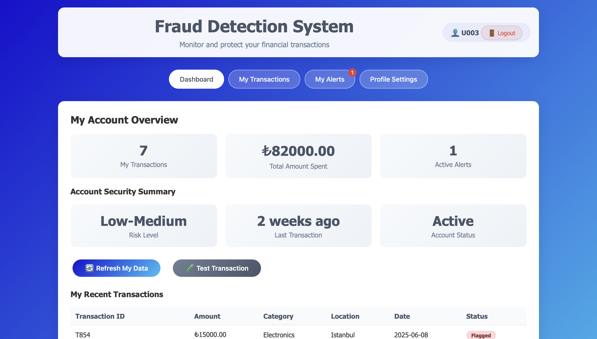

# Fraud Detection System

The Fraud Detection System is a web-based application developed to detect unusual
financial activities by analyzing user transactions. As online payments become more common, the
risk of fraud also increases. This system aims to identify suspicious behavior using rule-based
checks and personalized user profiles. Each user has a profile containing typical spending patterns,
such as preferred time windows, usual locations, and category limits. New transactions are
compared against these patterns to detect anomalies. If a transaction appears risky, the system
creates an alert and notifies the user.

The project combines database design, backend logic, and user interface development. It was built 
using PHP and MySQL, with a responsive frontend created in HTML, CSS, and JavaScript. The system 
provides a solid base for future improvements like machine learning and mobile integration.

---

## Login Page

## Dashboard Tab

